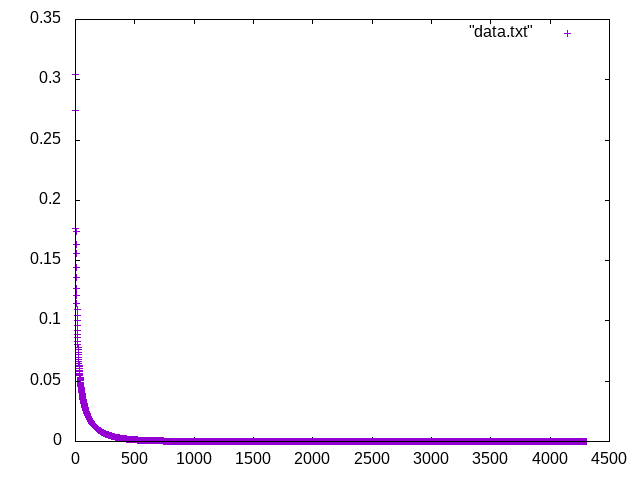
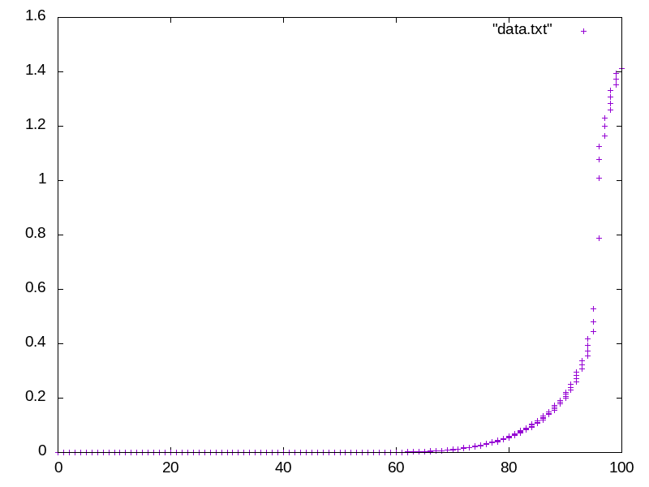
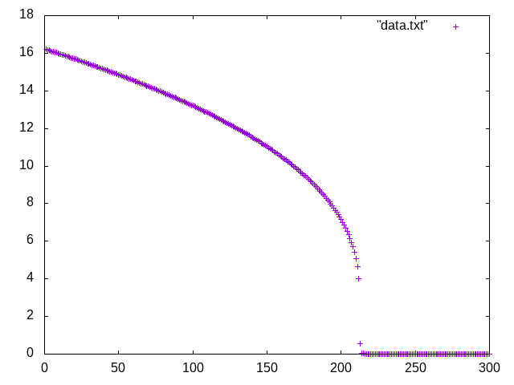

## Wojciech Ładyga - zadanie 21

Język technologia: c++

Program wykorzystuje algorytm Levenberga-Marquardta do znalezienia min funkcji Rosenbrocka (banana function) w postaci  

Algorytm ten jest dobrym wyjcsciem gdyż stosując metodę najwyższego spadku i gradientu możemy w bardzo dobry sposób znalesc minimum
tejże funkcji. Program rozpoczyna od wyznaczenia 8 losowych punktów np.
   
na przedziale <-10,10>. Losowany przedział bez problemu można rozszerzyć np do <-50,50>, <100,-100> itp.   

Nastęnie stosując ok 10 iteracji i wylosowane punkty nasz algorytm podąża w kierunku malejących wartości funkcji Rosembrocka
aż osiągnie wymagane minimum globalne, które wynosi 0.

Kod programu:

    /*
    * @Author: Wojciech Ladyga 
    * @Date: 2019-01-14
    * @Description: Zad 21
    */
    #include <math.h>
    #include <time.h>
    #include <iostream>
    #include <iomanip>
    #include <fstream>
    /*
    -wykład
    -https://books.google.pl/books?id=tyjrCAAAQBAJ&pg=PA106&lpg=PA106&dq=Banana+Function+Minimization+with+levenberg-marquardt&source=bl&ots=4W0U2R-hIr&sig=ACfU3U33wf-Q_yDc3LtQW0sa7J0gwhYQBw&hl=pl&sa=X&ved=2ahUKEwjvkMmtvZDgAhUMfFAKHWqeAuQQ6AEwBXoECAYQAQ#v=onepage&q=Banana%20Function%20Minimization%20with%20levenberg-marquardt&f=false
    -https://en.wikipedia.org/wiki/Levenberg%E2%80%93Marquardt_algorithm
    -https://www.researchgate.net/figure/Pseudocode-for-the-Levenberg-Marquardt-nonlinear-least-squares-algorithm-see-text-for_fig2_220492985
    -https://pl.wikibooks.org/wiki/Gnuplot
    */
    using namespace std;
    //globalne stałe
    const int iteracje = 10;           //min iteracji
    const int ilPunktowStartowych = 8; //ilosc punktow startowyh

    class LM
    {
        double punkt[2], punktMin[2], S[2], gradient[2], minimum = 0.0, Z, Hessian = 1.0, blad = 1.0;
        int test;

    public:
        void run()
        {
            //zapis do pliku
            ofstream myfile;
            myfile.open("data.txt");
            srand(time(NULL)); // aby działało randomowe losowanie
            for (int j = 0; j < ilPunktowStartowych; j++)
            {
                //losowanie między <-10,10> dla x, y
                for (int i = 0; i < 2; i++)
                {
                    punkt[i] = ((rand() % 20) - 10 + rand() / ((double)RAND_MAX));
                }

                //wypisanie wygenerowanych punktów
                cout << fixed << setprecision(5) << "(" << punkt[0] << ", " << punkt[1] << ")" << endl;

                Z = f(punkt);
                int przeskok = 45;
                //&& (qw < iteracje)
                //dokladnosc - 1e-32
                while ((Hessian < 1e-32) || (blad > 1e-32))
                {
                    //Liczymy gradient
                    //df/dx
                    gradient[0] = (400 * pow(punkt[0], 3) - 400 * punkt[0] * punkt[1] + 2.0 * punkt[0] - 2.0);
                    //df/dy
                    gradient[1] = (200 * punkt[1] - 200 * pow(punkt[0], 2));
                    for (int i = 0; i < 2; i++)
                    {
                        S[i] = -gradient[i] / sqrt(pow(gradient[i], 2) + pow(gradient[1], 2));
                    }

                    double P1[2], P2[2], HessTab[3], error[3], z[3];
                    int Jakobian = 0;
                    test = 0;

                    for (int i = 0; i < 2; i++)
                    {
                        P1[i] = punkt[i] + Hessian * S[i];
                        P2[i] = punkt[i] + 2.0 * Hessian * S[i];
                    }
                    z[1] = f(P1);
                    z[2] = f(P2);

                    while ((Jakobian < iteracje) && (test == 0))
                    {
                        if (Z <= z[1])
                        {
                            Hessian = Hessian / 2.0;
                            z[2] = z[1];
                            for (int i = 0; i < 2; i++)
                            {
                                P2[i] = P1[i];
                                P1[i] = punkt[i] + Hessian * S[i];
                            }
                            z[1] = f(P1);
                        }
                        else if (z[2] < z[1])
                        {
                            z[1] = z[2];
                            Hessian = 2.0 * Hessian;

                            for (int i = 0; i < 2; i++)
                            {
                                P1[i] = P2[i];
                                P2[i] = punkt[i] + 2.0 * Hessian * S[i];
                            }
                            z[2] = f(P2);
                        }
                        else
                        {
                            test = -1;
                        }
                    }

                    double Hmin = 0.0;
                    if ((4.0 * z[1] - 2.0 * Z - 2.0 * z[2]) < 0)
                    {
                        Hmin = Hessian * (4.0 * z[1] - 3.0 * Z - z[2]) / (4.0 * z[1] - 2.0 * Z - 2.0 * z[2]);
                    }
                    else
                    {
                        test = 4;
                        Hmin = Hessian / 3.0;
                    }

                    for (int i = 0; i < 2; i++)
                    {
                        punktMin[i] = punkt[i] + Hmin * S[i];
                    }

                    minimum = f(punktMin);

                    //ustawiamy aby nasze wartosci były dodatnie
                    HessTab[0] = fabs(Hmin);
                    HessTab[1] = fabs(Hmin - Hessian);
                    HessTab[2] = fabs(Hmin - 2.0 * Hessian);

                    for (int i = 0; i < 3; i++)
                    {
                        if (HessTab[i] < Hessian)
                        {
                            Hessian = HessTab[i];
                        }
                    }

                    //szacowanie bledu
                    bladObl(error, z);
                    Jakobian++;

                    przeskok++;
                    for (int i = 0; i < 2; i++)
                    {
                        punkt[i] = punktMin[i];
                    }

                    Z = minimum;
                    //skalowanie ilosci minimalizacji
                    if (przeskok == 50)
                    {
                        przeskok = 0;
                        myfile << fixed << setprecision(10) << minimum << endl;
                    }
                }
            }
            myfile.close();
        }

    private:
        //funkcja Rosembrocka f(x,y) = (1-x)^2 + 100*(y-x^2)^2
        //gdzie x[0] - to x
        //      x[1] - to y
        double f(double *punkt)
        {
            return pow(1 - punkt[0], 2) + 100 * pow(punkt[1] - pow(punkt[0], 2), 2);
        }

        //szacujemy bledy
        void bladObl(double error[], double z[])
        {
            for (int i = 0; i < 3; i++)
            {
                if (i == 0)
                {
                    error[i] = fabs(Z - minimum);
                }
                error[i] = fabs(z[i] - minimum);
            }

            for (int i = 0; i < 3; i++)
            {
                if (error[i] < blad)
                {
                    blad = error[i];
                }
                else if ((error[0] + error[1] + error[2]) == 0)
                {
                    blad = 0;
                }
            }
        }
    };

    int main()
    {
        LM lmAlg;
        lmAlg.run();
        return 0;
    }
  
W zależnosci ile ustawimy iteracji poczatkowych naszego algoeytmu i punktów startowych możemy potrzebować od 100 - 4500 kroków minimalizacyjnych aby osiągnąć pożądane minimum
Wyniki działania programu to:

gdzie oś dolna to ilość kroków (w przypadku 2 ostatnich obrazków oś zostala odpowiednio przeskalowana), a oś y to poszczególne minimalizacje

Jesli nie zalezy nam na osiągnięciu 0.0 przy dokładnosci  ``setprecision(10)`` to wystarczy nawet ok 10 kroków aby osiągnąć wartość 0.
Wtedy możemy osiągnąć takie wartosci    
    1.0984589360  
    0.0546420525  
    0.0259267301  
    0.0155208413  
    0.0101729781  
    0.0070125245  
    0.0049934329  
    0.0036375496  
    0.0026946807  
    0.0020221409  