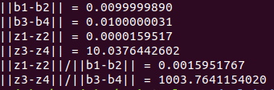

## Wojciech Ładyga - zadanie 3

Język technologia: c++, GSL  

W tym zadaniu, aby rozwiązać macierz odwrotną do A stosujemy dekompozycję LU

            gsl_permutation *per = gsl_permutation_alloc(N);
            int tmp;
            gsl_linalg_LU_decomp(symM, per, &tmp);
ponieważ odwracanie macierzy jest bardzo kosztowne, a taki zabieg da nam odpowiedni wynik i pozwoli zaoszczędzić zasoby obliczeniowe.

Wektory ```b1 i b2``` oraz ```b3 i b4``` różnią się nieznacznie między sobą.  
Więc mamy do czynienia ze źle uwarunkowanym zadaniem. W pierwszym przypadku niewielka zmiana w danych powoduje duże zmiany, a w drugim nieduże zaburzenia powodują niewielkie zmiany.

Kod programu:

        /*
        * @Author: Wojciech Ladyga 
        * @Date: 2018-11-11
        * @Description: Zad 3
        */
        #include <iostream>
        #include <stdio.h>
        #include <gsl/gsl_matrix.h>
        #include <gsl/gsl_blas.h>
        #include <gsl/gsl_linalg.h>
        #include <gsl/gsl_eigen.h>
        #include <iomanip>
        using namespace std;
        const int N = 5;

        //funkcja realizująca mnożenie macierzy przez wektor
        gsl_vector*liczVector(gsl_vector *v, gsl_vector *b, gsl_matrix * symM){
            double tmpp;
            
            for(int i = 0; i < N; i++){
                for(int j = 0; j < N; j++){
                    tmpp += gsl_matrix_get(symM, i, j)*gsl_vector_get(b, j);
                }
                gsl_vector_set(v, i, tmpp);
                tmpp = 0;
            }
            return v;
        }

        void licz(){
            //nasza macierz symetryczna
            gsl_matrix *symM = gsl_matrix_alloc(5, 5);
            
            //wypelnienie macierzy el
            double mTab[] = { -116.66654, 583.33346, -333.33308, 100.00012, 100.00012, 583.33346, -116.66654, -333.33308, 100.00012, 100.00012,-333.33308, -333.33308, 133.33383, 200.00025, 200.00025,100.00012, 100.00012, 200.00025, 50.000125, -649.99988, 100.00012, 100.00012, 200.00025, -649.99988, 50.000125 };
            
            //funkcjonalność pozwalająca zmienić zwykłą tablicę na macierz NxN
            gsl_matrix_view tmpM = gsl_matrix_view_array(mTab, N, N);
            //później należy umieścić ją w odpowiednim miejscu
            gsl_matrix_memcpy(symM, &tmpM.matrix);
                
            //alokacja pamieci dla wektorów b1, b2, b3 i b4
            gsl_vector *b1 = gsl_vector_alloc(N); 
            gsl_vector *b2 = gsl_vector_alloc(N); 
            gsl_vector *b3 = gsl_vector_alloc(N); 
            gsl_vector *b4 = gsl_vector_alloc(N); 

            //wypełnienie wektorów

            double tabB1[N] = {-0.33388066, 1.08033290, -0.98559856, 1.31947922, -0.09473435};
            //b1
            for(int i = 0; i < N; i++){
                gsl_vector_set(b1, i, tabB1[i]);
            }

            //b2
            for(int i = 0; i < N; i++){
                gsl_vector_set(b2, i, tabB1[i]);
                if(i == 2){
                    gsl_vector_set(b2, i, tabB1[i]+0.00000001);
                }else if(i == 3){
                    gsl_vector_set(b2, i, tabB1[i]+0.00707106);
                }else if(i == 4){
                    gsl_vector_set(b2, i, tabB1[i]-0.00707106);
                }
            }

            double tabB2[N-2] = {0.72677951, -0.27849178, 0.96592583};
            //b3
            for(int i = 0; i < N; i++){
                if(i < 2){
                    gsl_vector_set(b3, i, tabB2[0]);
                }
                if(i == 2){
                    gsl_vector_set(b3, i, tabB2[1]);
                }
                if(i > 2){
                    gsl_vector_set(b3, i, tabB2[2]);
                }
            }

            //b4
            for(int i = 0; i < N; i++){
                if(i < 2){
                    gsl_vector_set(b4, i, tabB2[0]+0.00353554);
                }
                if(i == 2){
                    gsl_vector_set(b4, i, tabB2[1]+0.00707107);
                }
                if(i > 2){
                    gsl_vector_set(b4, i, tabB2[2]+0.00353553);
                }
            }
                
            //dekompozycja LU
            gsl_permutation *per = gsl_permutation_alloc(N);
            int tmp;
            gsl_linalg_LU_decomp(symM, per, &tmp);	
            
            
            //alokacja pamięci na wyniki mnożenia macierzy przez wektor
            gsl_vector *z1 = gsl_vector_alloc(N); 
            gsl_vector *z2 = gsl_vector_alloc(N); 
            gsl_vector *z3 = gsl_vector_alloc(N); 
            gsl_vector *z4 = gsl_vector_alloc(N); 
            
            //konczymy dekompozucje LU
            gsl_linalg_LU_solve(symM, per, b1, z1);
            gsl_linalg_LU_solve(symM, per, b2, z2);
            gsl_linalg_LU_solve(symM, per, b3, z3);
            gsl_linalg_LU_solve(symM, per, b4, z4);

            //operacje na wektorach i macierzach
            //www.gnu.org/software/gsl/manual/html_node/Vector-operations.html
            gsl_vector_sub(b1, b2); //odejmuje i przechowuje wartość w b1
            gsl_vector_sub(b3, b4); //odejmuje i przechowuje wartość w b3
            gsl_vector_sub(z1, z2); //odejmuje i przechowuje wartość w z2
            gsl_vector_sub(z3, z4); //odejmuje i przechowuje wartość w z3

            //liczenie normy euklidesowej
            double n1 = gsl_blas_dnrm2(b1);
            double n2 = gsl_blas_dnrm2(b3);
            double n3 = gsl_blas_dnrm2(z1);
            double n4 = gsl_blas_dnrm2(z3);
            
            //wyniki
            cout << "||b1-b2|| = " << setprecision(10) << fixed << n1 << endl;
            cout << "||b3-b4|| = " << setprecision(10) << fixed << n2 << endl;
            cout << "||z1-z2|| = " << setprecision(10) << fixed << n3 << endl;
            cout << "||z3-z4|| = " << setprecision(10) << fixed << n4 << endl;
            cout << "||z1-z2||/||b1-b2|| = " << setprecision(10) << fixed << n3/n1 << endl;	
            cout << "||z3-z4||/||b3-b4|| = " << setprecision(10) << fixed << n4/n2 << endl;	


            //czyszcznie pamieci
            gsl_vector_free(b1);
            gsl_vector_free(b2);
            gsl_vector_free(b3);
            gsl_vector_free(b4);
            gsl_matrix_free(symM);
            gsl_permutation_free(per);
        }

        int main(){
            licz();
            return 0;
        }


Wyniki działania programu to:

