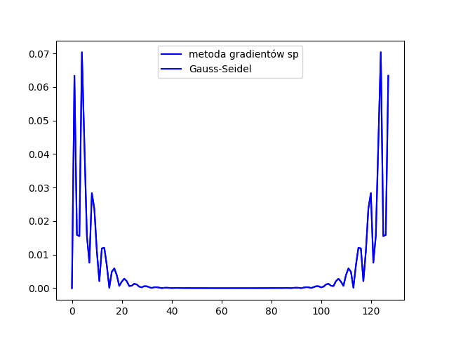
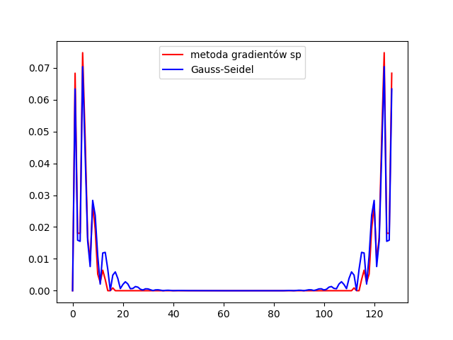

## Wojciech Ładyga - zadanie 4

Język technologia: Python, numpy, scipy  

Aby uwzględnić strukturę macierzy zastosowałem ``csr_matrix`` pozwalająca stworzyć macierz rzadką.  
W każdym z algorytmów iteracyjnych zastosowałem tolerancję równą ``1.0e-2``. Dla mniejszych tolerancji metody te dają bardzo podobne, omalże identyczne wyniki np. dla ``1.0e-9``. Wtenczas generując wykres dostajemy 2 pokrywające się wykresy.

Funkcja ``gauss_seidel`` liczy metodą Gaussa-Seidela na podstawie wzoru:   

,a metoda gradientów sprzężonych na podstawie algorytmu:

Obliczając złożoność uzyskałem następujące wyniki dla dokładności ``1.0e-2``  

Jeśli zastosujemy np. tolerancję ``1.0e-9`` to uzyskamy wyniki   

oraz nasz wykres zbieżności da nam wynik:

wyniki obu metod iteracyjnych się pokryją

Kod programu:

    # imporujemy wszystkie potrzebne biblioteki
    import pylab
    import numpy as np

    from math import sqrt
    from numpy import linalg as LA

    # pozwalają obsłużyć macierz rzadką
    from scipy.sparse import csr_matrix, tril
    from scipy.sparse.linalg import inv

    tol = 1.0e-2  # tolerancja
    N = 128  # wielkosc macierzy

    # https://docs.scipy.org/doc/scipy/reference/generated/scipy.sparse.csr_matrix.html
    A = csr_matrix((N, N), dtype=int).toarray()  # tworze miejsce na macierz rzadką
    e = [0] * N
    x = [0] * N  # wektor wynikowy
    it = 60  # ilosc iteracji

    # wypelnienie wektora z samymi 1
    for i in range(0, N):
        e[i] = 1

    # wypelnienie macierzy
    for x in range(0, N):
        A[x][x] = 4
        j = x + 1
        k = x + 4
        if j < N:
            A[x][j] = 1
            A[j][x] = 1
        if k < N:
            A[x][k] = 1
            A[k][x] = 1

    c = 0  # zmienna używana do liczenia złożoności

    # funkcja licząca Gaussa-Seidela
    def gauss_seidel(A, e, x, it, c, tol):
        D = tril(A)  # macierz dolnotrójkątna
        G = A - D  # macierz górnotrójkątna

        # nasza iteracja
        for i in range(it):
            c += 1
            x0 = x  # ustawiam, że wektor od której zaczniemy szukać będzie się równać wektorowi x
            x = inv(D).dot(e - G.dot(x))

            # sprawdzamy tolerancję
            tmp = abs((LA.norm(x) - LA.norm(x0))/LA.norm(x))*100
            if (tmp <= tol):
                break

        print("Złożoność GS: ")
        print(c)
        return x

    wynik = gauss_seidel(A, e, x, it, c, tol)
    k = [0] * N  # wektor przechowywujący wynik metody Gaussa-Seidela

    # wynik zapisuje do pliku
    file = open("wynik.txt", "w")
    for x in range(0, N):
        if(x < N):
            k[x] = wynik[x, 0]  # przypisuje dokladny wynik obliczeń metodą Gaussa-Seidela
        # ustawiam dokładnosc zapisu do 7-cyfr
        file.write(str(np.around(wynik[x, 0], decimals=7)))
        file.write("\n")
    file.close()

    # funkcja licząca metodą gradientów sprzęzonych
    def grad(A, e, tol, x, c):
        # warunki początkowe
        r = A.dot(x) - e
        norma = r.dot(r)  # norma r początkowego
        p = - r
        for i in range(it):  # iteracja
            c += 1
            a = norma / p.dot(A.dot(p))
            x += a * p
            r += a * A.dot(p)

            # sprawdzamy tolerancję
            b = r.dot(r) / norma
            norma = r.dot(r)
            if r.dot(r) < tol:  # sprawdzam czy miesci się w tolerancji
                break
            p = b * p - r

        print("zlozonosc gradientow sp: ")
        print(c)
        return x

    xx = np.ones(N)
    a = grad(A, e, tol, xx, c)  # wynik liczenia metodą gradientów sprzężonych

    # zapis metody gradientów sprzężonych do pliku
    file = open("wynik2.txt", "w")
    for x in range(0, N):
        file.write(str(np.around(a[x], decimals=7)))
        file.write("\n")
    file.close()

    # macierze służące do przechowywania danych w celu przedstawienia graficznie zbierzności metod
    b = [0] * (N)
    bb = [0] * (N)

    # iteruje od N doc 0 i liczę normę x(k) - x(k-1) dla obu metod
    for i in range(N-1, 0, -1):
        b[i] = np.linalg.norm(a[i]-a[i-1])
        bb[i] = np.linalg.norm(k[i]-k[i-1])

    # algorytm Choleskiego
    def cholesky(A, c):
        L = np.zeros_like(A)
        for x in range(N):
            for y in range(x+1):
                c += 1
                sum = np.dot(L[x, :y], L[y, :y])
                if (x == y):  # jesli diagonala
                    L[x, y] = sqrt(max(A[x, x] - sum, 0))
                else:
                    L[x, y] = (1.0 / L[y, y]) * (A[x, y] - sum)

        print("zlozonosc Choleskiego: ")
        print(c)
        # daje ona nam macierz wynikową gdzie wyniki są na głównej diagonali
        return L

    cholesky(A, c)

    # dla tolerancji 1.0e-2 wykresy pokrywają się
    #pylab.legend(("red - GS", "blue - gradient"), loc='upper right')
    pylab.plot(b, color="r", label="metoda gradientów sp")
    pylab.plot(bb, color="b", label="Gauss-Seidel")
    pylab.legend()
    pylab.show()

  
Wykres  

Wyniki działania programu to:

    1. metoda Gaussa_Seidela
    0.1942772
    0.1309297
    0.1467953
    0.1623114
    0.091962
    0.1352084
    0.1195782
    0.1119972
    0.1403546
    0.1166974
    0.1276858
    0.1297669
    0.1179254
    0.1299611
    0.1232148
    0.1233239
    0.1282153
    0.1223188
    0.1261693
    0.1255074
    0.1235708
    0.1263785
    0.1242824
    0.1249062
    0.1256156
    0.1243145
    0.125416
    0.1249701
    0.1247461
    0.1253316
    0.1247694
    0.1250512
    0.1250983
    0.1248438
    0.1251233
    0.1249578
    0.1249657
    0.1250716
    0.1249361
    0.1250285
    0.1250096
    0.1249682
    0.1250323
    0.1249825
    0.1249989
    0.1250136
    0.1249841
    0.12501
    0.1249988
    0.1249945
    0.1250076
    0.1249945
    0.1250015
    0.1250021
    0.1249964
    0.1250029
    0.1249989
    0.1249993
    0.1250017
    0.1249984
    0.1250007
    0.1250002
    0.1249991
    0.1250009
    0.1249996
    0.1249997
    0.1250008
    0.1249993
    0.125
    0.1250009
    0.1249986
    0.1250008
    0.1250008
    0.1249974
    0.1250031
    0.1249986
    0.1249976
    0.1250063
    0.1249929
    0.1250028
    0.1250058
    0.1249858
    0.1250158
    0.1249936
    0.1249879
    0.1250302
    0.1249653
    0.1250162
    0.125022
    0.1249385
    0.1250749
    0.1249581
    0.1249653
    0.1251204
    0.1248403
    0.1251064
    0.1250431
    0.1247728
    0.1253348
    0.1247381
    0.1249783
    0.1254122
    0.1243119
    0.1256229
    0.1248984
    0.1242865
    0.1263801
    0.1235647
    0.1255143
    0.1261652
    0.1223182
    0.1282198
    0.1233183
    0.1232186
    0.1299607
    0.1179226
    0.1297709
    0.1276827
    0.1166983
    0.1403559
    0.1119948
    0.1195804
    0.1352073
    0.0919617
    0.1623124
    0.1467941
    0.1309304
    0.194277

    2. metoda gradientów sprzężonych
    0.1965552
    0.1282609
    0.1462961
    0.1643312
    0.0895946
    0.137677
    0.1209678
    0.1115736
    0.1386689
    0.1193419
    0.1245775
    0.1271954
    0.120753
    0.1242434
    0.1242434
    0.1242434
    0.125116
    0.125116
    0.125116
    0.125116
    0.125116
    0.125116
    0.125116
    0.125116
    0.125116
    0.125116
    0.125116
    0.125116
    0.125116
    0.125116
    0.125116
    0.125116
    0.125116
    0.125116
    0.125116
    0.125116
    0.125116
    0.125116
    0.125116
    0.125116
    0.125116
    0.125116
    0.125116
    0.125116
    0.125116
    0.125116
    0.125116
    0.125116
    0.125116
    0.125116
    0.125116
    0.125116
    0.125116
    0.125116
    0.125116
    0.125116
    0.125116
    0.125116
    0.125116
    0.125116
    0.125116
    0.125116
    0.125116
    0.125116
    0.125116
    0.125116
    0.125116
    0.125116
    0.125116
    0.125116
    0.125116
    0.125116
    0.125116
    0.125116
    0.125116
    0.125116
    0.125116
    0.125116
    0.125116
    0.125116
    0.125116
    0.125116
    0.125116
    0.125116
    0.125116
    0.125116
    0.125116
    0.125116
    0.125116
    0.125116
    0.125116
    0.125116
    0.125116
    0.125116
    0.125116
    0.125116
    0.125116
    0.125116
    0.125116
    0.125116
    0.125116
    0.125116
    0.125116
    0.125116
    0.125116
    0.125116
    0.125116
    0.125116
    0.125116
    0.125116
    0.125116
    0.125116
    0.1242434
    0.1242434
    0.1242434
    0.120753
    0.1271954
    0.1245775
    0.1193419
    0.1386689
    0.1115736
    0.1209678
    0.137677
    0.0895946
    0.1643312
    0.1462961
    0.1282609
    0.1965552
